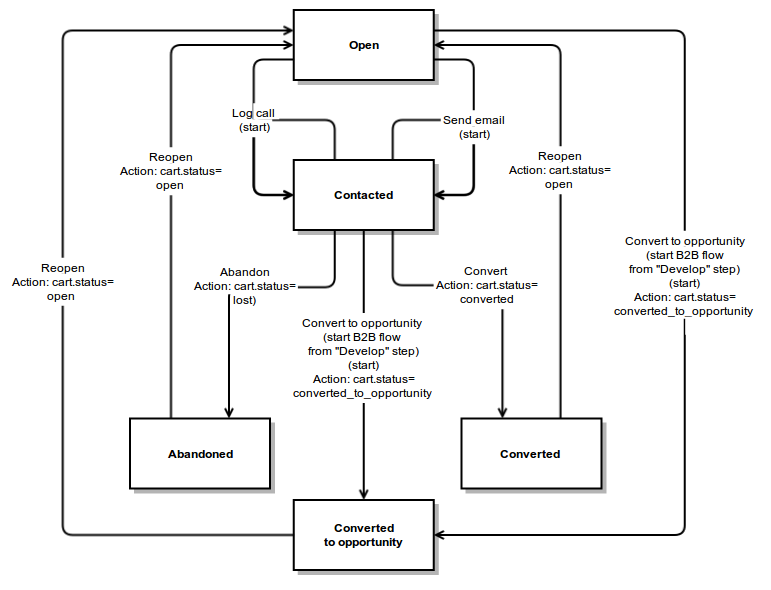

B2C Workflows
===============

Table of Contents
-----------------
 - [Abandoned Shopping Cart Flow](#abandoned-shopping-cart-flow)
 - [Order Follow Up Flow](#order-follow-up-flow)

Abandoned Shopping Cart Flow
----------------------------

This workflow is used to process shopping cart from external sources (f.e. from Magento) and to try
to convert it to opportunity.

The workflow should be managed trough `orocrm_magento.manager.abandoned_shopping_cart_flow` service that is an instance of `Oro\Bundle\WorkflowBundle\Model\WorkflowAwareManager`

### Definitions

* Shopping cart must contain email of phone information (directly or in related entities)
that can be used to contact customer;
* User can be contacted through email of phone any number of times, all actions must be logged;
* Workflow can be finished as abandoned (should not be connected any more), converted and converted to opportunity
(new opportunity created);
* Worfklow can be reopened from any finish step.

### Attributes

* **Shopping Cart** - main managed entity attribute that stores Shopping Cart entity;
* **Opportunity** - entity that can be created after "Convert to opportunity" transition;
* **Opportunity name** - temporary property used to create opportunity;
* **Call** - entity of last logged phone call, includes;
    * _phone number_;
    * _call subject_;
    * _call date_;
    * _call direction_ (Incoming, Outgoing);
    * _call status_ (In progress, Completed);
    * _call duration_;
* **Email** - entity of last written email, includes;
    * _email from_ - this and following attributes are related to last email;
    * _email to_;
    * _email subject_;
    * _email body_;
* **Notes** - string attribute that stores shopping cart notes.

### Diagram

### Steps

* **Open** - processing of shopping cart just started, or shopping cart was reopened before;
* **Contacted** - manager contacting to customer from shopping cart (contact and/or account) through email or phone;
* **Abandoned** - processing of shopping cart was stopped due to some reason and it should not be processed
until reopen;
* **Converted** - shopping cart was successfully converted;
* **Converted to opportunity** - shopping cart was successfully converted and new opportunity was created
(it can be processed separately using B2B flow).

### Transitions

* **Log call** - shopping cart must have status "Open" to allow this transition:
    * open form with Phone number (required), Call subject (required), Call date (required), Call direction (required), Call duration and Notes attributes;
    * create new Call entity with status "In process";
* **Send email** - shopping cart must have status "Open" to allow this transition:
    * open form with Email from (required), Email to (required), Email subject (required), Email body (required) and Notes attributes;
    * send email with specified parameters;
* **Convert** - shopping cart must have status "Open" to allow this transition:
    * open form with Notes attribute;
    * set shopping cart status to "converted";
* **Convert to opportunity** - shopping cart must have status "Open" to allow this transition:
    * open form with Opportunity name and Notes attributes;
    * set shopping cart status to "converted_to_opportunity";
    * create new Opportunity entity with status "In progress";
* **Abandon** - shopping cart must have status "Open" to allow this transition:
    * open form with Notes attribute;
    * set shopping cart status to "lost";
* **Reopen** - shopping cart must have status "Converted", "Converted to opportunity" or "Abandoned" to allow this transition:
    * open form with Notes attribute;
    * set shopping cart status to "open";
    * reset all attributes related to call, email and opportunity.

Order Follow Up Flow
--------------------

This workflow is used to process external orders (f.e. from Magento) and contact customers.

### Definitions

* Used to process specific orders from CRM;
* Customer can be contacted through email or phone call;
* After contacting manager should record feedback about the order;
* Order flow can not be reopened.

### Attributes

* **Order** - main managed entity attribute that stores Order entity;
* **Call** - entity of last logged phone call, includes;
    * _phone number_;
    * _call subject_;
    * _call date_;
    * _call direction_ (Incoming, Outgoing);
    * _call status_ (In progress, Completed);
    * _call duration_;
* **Email** - entity of last written email, includes;
    * _email from_ - this and following attributes are related to last email;
    * _email to_;
    * _email subject_;
    * _email body_;
* **Notes** - string attribute that stores shopping cart notes;
* **Feedback** - string attribute that stored order feedback.

### Diagram

### Steps

* **Not contacted** - customer was not contacted yet or there was no reply from him;
* **Emailed** - managed sent an email to customer and waited for the response;
* **Called** - manager called customer and have to either record feedback or reply him again later;
* **Contacted** - customer was contacted and processing of the order is finished.

### Transitions

* **Log call**:
    * open form with Phone number (required), Call subject (required), Call date (required), Call direction (required), Call duration and Notes attributes;
    * create new Call entity with status "In process";
* **Send email**:
    * open form with Email from (required), Email to (required), Email subject (required), Email body (required) and Notes attributes;
    * send email with specified parameters;
* **No reply**:
    * open form with Notes attribute;
* **Record feedback**:
    * open form with Feedback and Notes attributes.
