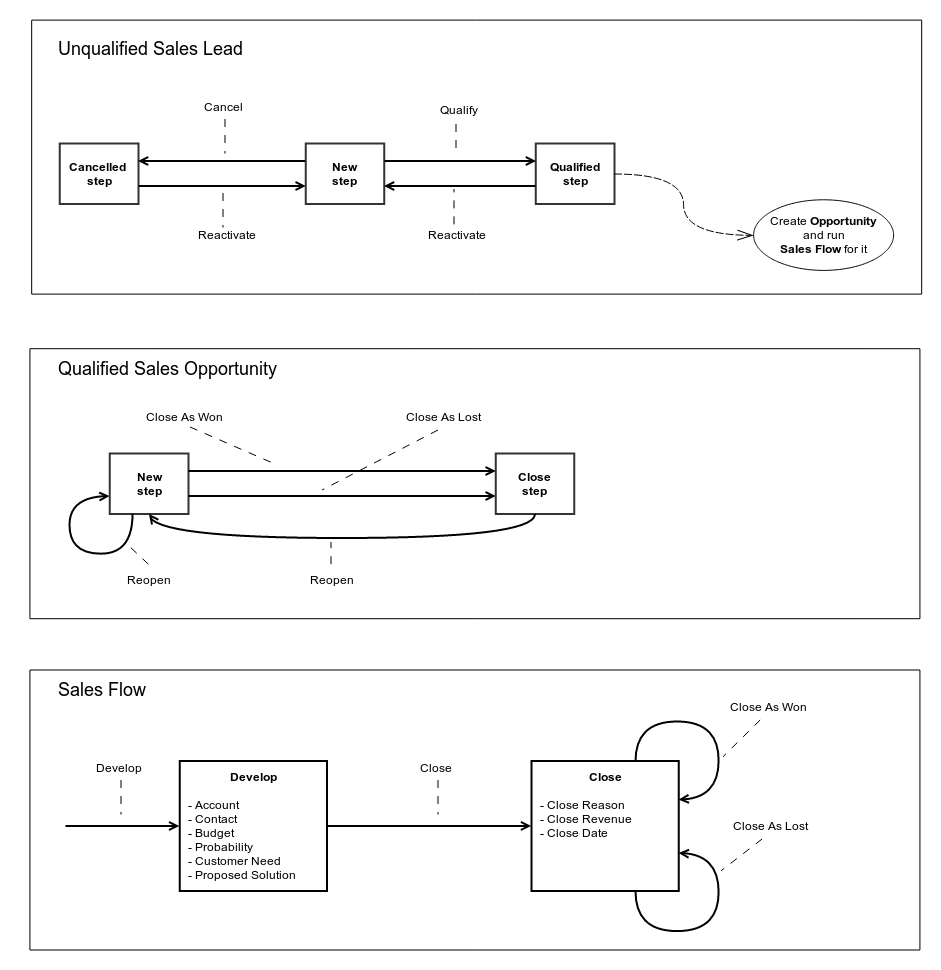

Workflows
=========

Table of Contents
-----------------
 - [Workflows Diagram](#workflows-diagram)
 - [Unqualified Sales Lead](#unqualified-sales-lead)
 - [Qualified Sales Opportunity](#qualified-sales-opportunity)
 - [Sales Flow](#sales-flow)

Workflows Diagram
-----------------

Following diagram shows available workflows steps and transitions.

Unqualified Sales Lead
----------------------

**Managed entity:** Lead (OroCRM\Bundle\SalesBundle\Entity\Lead).
**Workflow Type:** entity

### Steps

#### New Step

**Allowed Transitions:**
* Qualify
* Cancel

#### Cancelled Step

**Allowed Transitions:**
* Reactivate

#### Qualified Step

**Allowed Transitions:**
* Reactivate

### Transitions

#### Qualify

**Conditions:**
 * *Lead* has *New* status

**Post Actions:**
 * Switch *Lead* status to *Qualified*
 * If *Lead* doesn't have *Contact* entity (OroCRM\Bundle\ContactBundle\Entity\Contact) create it with first name, last
 name, job title, and name as a description of *Contact*
 * If *Lead* has *Address* entity (Oro\Bundle\AddressBundle\Entity\Address) add it to *Contact* as *Contact Address*
 * If *Lead* has *Email* entity, add it to *Contact*
 * If *Lead* has *Phone* entity, add it to *Contact*
 * Create *Opportunity* entity (OroCRM\Bundle\SalesBundle\Entity\Opportunity) based on *Lead* with *In Progress*
 status
 * Start workflow *Sales Flow* with created *Opportunity*
 * Redirect user to created workflow

#### Reactivate

**Conditions:**
 * *Lead* has *Qualified* status

**Post Actions:**
 * Switch *Lead* status to *Cancelled*

#### Cancel

**Conditions:**
 * *Lead* has *New* status

**Post Actions:**
 * Switch *Lead* status to *Cancelled*

Qualified Sales Opportunity
---------------------------

Sales Flow
----------
