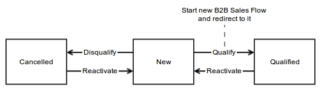

Sales Workflows
===============

Table of Contents
-----------------
 - [Sales Lead Flow](#sales-lead-flow)
 - [B2B Sales Flow](#b2b-sales-flow)

Sales Lead Flow
---------------

This sales flow is an entity flow for lead - it means all transitions are available from lead view page and
there are no step forms.

### Definitions

* Contacts or companies that are essentially un-qualified sales leads. In general, there is no current or past
relationship history with these leads.
* CRM Leads should be qualified as a potential customer before they are “promoted” to a CRM Contact and/or
CRM Opportunity.
* CRM Leads are NOT synchronized with the Outlook CRM Client, therefore they will NOT be listed as Outlook Contacts.
Leads can only be managed via CRM.

Examples:
* Web visitors who had submitted a website questionnaire, and additional follow-up is needed.
* Imported contacts from a third party list.
* Business cards procured from an event or tradeshow.

### Attributes

* **Lead** - lead object that encapsulates following properties:
    * _status_ - used to find allowed transitions (can be "New", "Cancelled" or "Qualified");
    * _name_ - used as default opportunity name;
    * _customer_ - used as default opportunity customer;
    * _companyName_ - used to find default customer if customer is not specified;
    * _contact_ - used as default opportunity contact, if no customer is set new contact will be created based
on contact information properties;
    * _contact information properties_ - list of properties used to create new contact
(first name, last name, email, phone, address etc).
* **Opportunity Name** - name of created opportunity, default value set from lead name;
* **Customer** - entity that encapsulates business information, f.e. company data;
* **Company Name** - name of a company, use lead company name as default value, used to automatically
find customer by its name (customer name is a company name).

### Diagram

### Steps

* **New** - lead was just created or reactivated, and it has fresh data;
* **Cancelled** - lead was disqualified (cancelled), and can't be qualified (f.e. contact was lost);
* **Qualified** - lead was qualified and promoted to opportunity and, optionally, new contact and customer were created.

### Transitions

* **Qualify** - lead must have status "New" to allow this transition:
    * open form with attributes "Opportunity name", "Customer" and "Company name";
    * change lead status to "Qualified";
    * if lead has no contact then create a new one with address, email and phone based on lead data;
    * if lead has no customer then try to find it based on company name, if customer not found -
create a new one based on lead data;
    * create new opportunity with specified name, contact and customer, and set opportunity status to "In progress";
    * start new B2B Sales Flow using "Qualify" transition and redirect to it.
* **Disapprove** - lead must have status "New" to allow this transition:
    * changes lead status to "Cancelled".
* **Reactivate** - lead must have status "Qualified" or "Cancelled" to allow this transition:
    * changes lead status to "New".

B2B Sales Flow
--------------

Sales flow is an example of possible sale circle in the company. It helps user to capture initial information
about sale (lead), qualify a sale opportunity, develop and close it. Actions that can trigger workflow:

* "Save and Qualify" button from lead creation page and "Qualify" button from lead view page are start
"Qualify" definition from Sales Lead Flow that starts B2B Sales Flow using "Qualify" transition;
* "Develop" button from opportunity view page that starts B2B Sales Flow using "Develop" transition;
* "Close as lost" and "Close as won" buttons from opportunity view page that starts and closes
B2B Sales Flow with appropriate transition.

Sales flow can have many different variations and depends on company business processes.
Goal of sales flow is to lead user through company sales process and identify necessary data on each step
of the process.

### Definitions

* The CRM Opportunity signals the kickoff of your company’s sales process with a potential or existing client.
* The history of Open, Won or Lost Opportunities can always be found in the related Customer or Contact record.
* All metrics related to the opportunity are measured here, such as:
    * Estimated Revenue.
    * Percent Probability of Closing.
    * Sales Stages.
    * Rating (Hot, Warm, Cold).
    * Follow-up activities related to the opportunity.

### Attributes

* **Opportunity** - entity that encapsulates following properties:
    * _status_ - used to find allowed transitions (can be "Identification & Alignment", "Needs Analysis",
                "Solution Development", "Negotiation", "In Progress", "Closed Won", "Closed Lost");
    * _name_ - name of current entity, required data;
    * _contact_ - related contact entity;
    * _customer_ - related customer entity, required data;
    * _budgetAmount_ - amount of budget for current entity;
    * _probability_ - probability of winning, set to 0 for lost and 100 for won opportunity;
    * _customerNeed_ - string representation of required customer need;
    * _proposedSolution_ - string representation of proposed solution;
    * _closeReason_ - why this opportunity was closed (can be "Outsold", "Won" and "Cancelled");
    * _closeRevenue_ - close revenue of opportunity, sets to 0 if opportunity was lost;
    * _closeDate_ - date when opportunity was closed;
* **Contact** - this and all following attributes are represent appropriate opportunity properties;
* **Customer**;
* **Probability**;
* **Budget amount**;
* **Customer need**;
* **Proposed solution**;
* **Close reason**;
* **Close revenue**;
* **Close date**.

### Diagram

### Steps

* **Qualify** - opportunity was created, edited or reactivated, and only optional attribute
that can be selected is Contact;
* **Develop** - opportunity was developed, user entered Proposed solution Contact, Customer, Budget amount,
Probability, Customer need and Proposed solution attribute values;
* **Close** - opportunity was close either as won or as lost, user entered Close reason, Close revenue and Close date.

### Transitions

* **Qualify** - opportunity must have status "In progress" to allow this transition, not allowed from UI:
    * start transition that used as entry point from Sales Lead Flow;
    * set opportunity properties to appropriate attributes.
* **Develop** - opportunity must have status "In progress" to allow this transition:
    * has form that allows user to enter attributes Contact, Customer, Budget amount, Probability, Customer need and Proposed solution;
    * set entered data to opportunity.
* **Close as won** - opportunity must have status "In progress" to allow this transition:
    * has form with attributes Close revenue and Close date;
    * set opportunity status to "Won" and close reason to "Won";
    * set probability to 100%
    * set entered data to opportunity;
    * redirect to opportunity view page.
* **Close as lost** - opportunity must have status "In progress" to allow this transition:
    * has form with attributes Close reason ("Outsold" or "Cancelled") and Close date;
    * set opportunity status to "Lost";
    * set probability to 0% and close revenue to 0;
    * set entered data to opportunity;
    * redirect to opportunity view page.
* **Edit** - opportunity must have status "Won" to allow this transition:
    * set opportunity status to "In progress".
* **Requalify** - opportunity must have status "Lost" to allow this transition:
    * set opportunity status to "In progress";
    * reset value of attributes Budget amount, Probability, Close reason, Close date and Close revenue.
